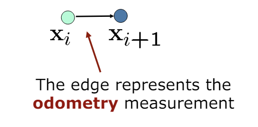
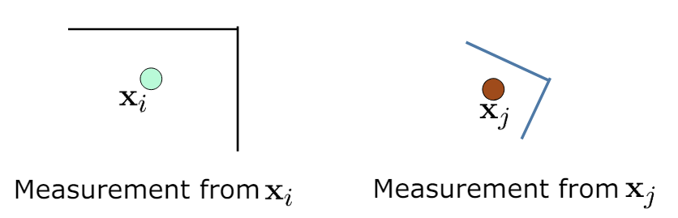

# SLAM
An attempt at implementing Simultaneous Localization And Mapping (SLAM). Computer Vision Final project THU Spring 2024
Both LIDAR 2D SLAM and Visual SLAM are implemented.

## The SLAM Problem

### Given:

- A robot's controls
    - U = {u_1, u_2, ..., u_k}

The odometry measurements over all time frames from t=0 to t=k (speedometer, gyroscope, etc.). Over time,
if we only rely on these to determine path of robot, there will be accumulated
error which leads to a grossly wrong path. Thus the need for SLAM.

- Relative observations
    - Z = {z_1, z_2, ..., z_n}

The observations taken from the robot of the landmarks. (Could be from
camera, radar, lidar, etc. ?). Has some uncertainty.

### Wanted:

- Map of features
    - m = {m_1, m_2, ..., m_n}

The features are the landmarks. Each m_i describes the location of the i-th
landmark.

- Path of the robot
    - X = {x_0, x_1, ..., x_k}

Each x_i describes the position of the robot at time i.

## Graph-Slam

We can represent our problem using Graphs (nodes connected with edges).

- Each node represents a position (location)
- Edges between two nodes represent a *constraint*
- Constraints can happen due to:
    - odometry measurement
    - the robot observes the same part of the environment (landmark)

### Creating edges

If: robot moves from x_i to x_i+1 according to odometry
measurements:

If: robot observes the same part
of the environment from x_i and x_j

### Nodes

Can represent
- Robot positions
- Feature (landmarks) positions

### Idea of Graph-SLAM

Build the graph
and find a node configuration that
minimize the error introduced by the
(noisy) constraints 