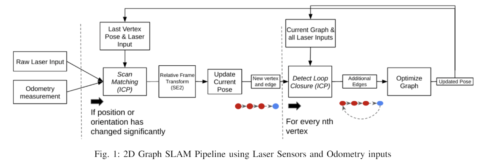
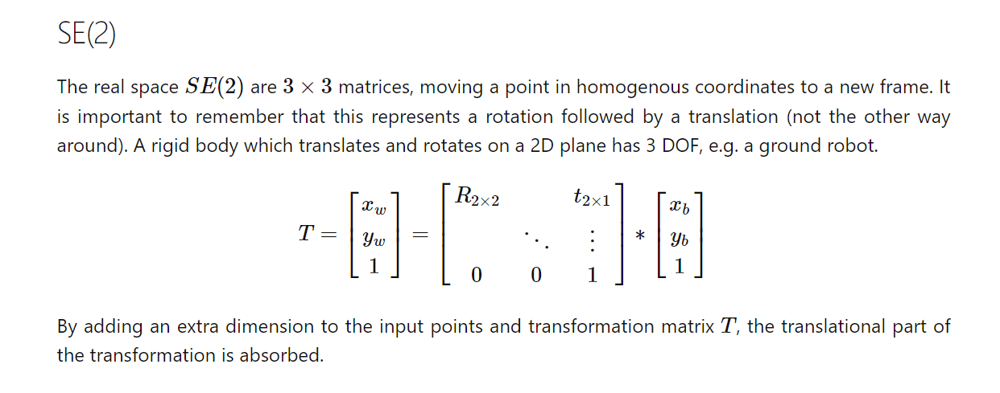
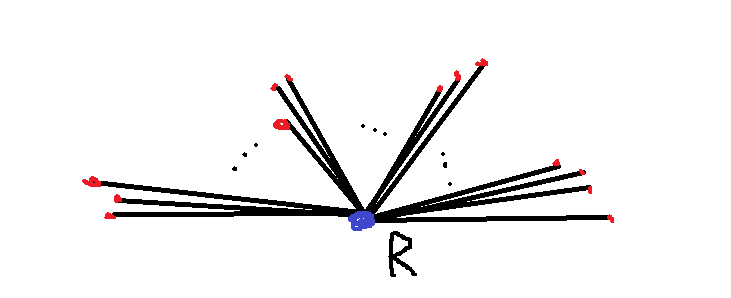

### Implementation

- Base our project on https://github.com/HobbySingh/Graph-SLAM.
and https://github.com/goktug97/PyGraphSLAM



### Dataset

Use the same dataset as in the GitHub repo above. [Link to dataset.](http://ais.informatik.uni-freiburg.de/slamevaluation/datasets.php)

The dataset is formatted as series of lines, each of which
either correspond to an odometry measurement (the line will begin with`ODOM`)
or laser measurements (the line begins with `FLASER` or `RLASER`).

A `ODOM` measurement is a 2D position (x,y) along with an angle (theta).

A `LASER` measurement is a series of (usually) 180 numbers, one for each rotation
angle. Each number is the distance to the nearest object detected at that angle.
(? THIS MAY NOT BE TRUE ?)

The formatting is as follows:
```angular2html
# ODOM x y theta tv rv accel
# FLASER num_readings [range_readings] x y theta odom_x odom_y odom_theta
# RLASER num_readings [range_readings] x y theta odom_x odom_y odom_theta
```

### Back End
Takes care of the graph optimization. We will make use
of `g2o` module, specifically the `SparseOptimizer` class.

- Implement the `Graph` class template below.
- The SE2 object refers to objects which are in fact 3x3 matrices. See figure below:



```python
import g2o
import numpy as np

class Graph: 
    """
    A Graph class template inspired from:
    https://github.com/goktug97/PyGraphSLAM/
    This class makes use of g2o's SparseOptimizer to optimize the graph.
    """
    def __init__(self):
        # have the optimizer from g2o as a member of the class
        self.optimizer = g2o.SparseOptimizer()
        solver = g2o.BlockSolverSE2(g2o.LinearSolverCholmodSE2())
        solver = g2o.OptimizationAlgorithmLevenberg(solver)
        self.optimizer.set_algorithm(solver)
        
    def optimize(self):
        """
        Use the g2o optimizer to optimize the graph.
        """

    def add_vertex(self, id, pose, fixed=False):
        """
        Add a vertex to the graph with given id and pose. The vertices
        should actually be added as `g2o.VertexSE2` objects. They should be
        added to the `self.optimizer` object using the `add_vertex` method from
        the optimizer class.
        
        :param id: ID of the given vertex (int)
        :param pose: A g2o.SE2 object representing a robot pose. 
        :param fixed: Whether the SE2 vertex is fixed.
        """

    def add_edge(self, 
                 vertices, 
                 measurement, 
                 information=np.identity(3),
                 robust_kernel=None):
        """
        Adds an edge to the graph. Edges represent a 'constraint'. The edge
        should actually be added as `g2o.EdgeSE2` objects. They should be
        added to the `self.optimizer` object using the `add_edge` method from
        the optimizer class.
        
        :param vertices: The vertices that are connected to the edge. Could also be
        indices representing the id of vertices which are already in the graph.
        :param measurement: A SE2 object representing the measurement that defines the constraint.
        :param information: Information matrix (np array: 3x3). Inverse of the covariance matrix.
        :param robust_kernel: Should be a g2o.RobustKernelDCS() object, or None.
        """
```

### Front End

Takes care of reading sensor (laser) data and
odometry data. Update the pose graph. Can be separated
into three phases:
- Parsing
- Updating the Graph
- Drawing and plotting the Graph

#### Parsing
- Read data log file line by line:
  - Get `FLASER` data
  - Convert laser pts to 2D points (see diagram below)
  - Get `ODOM` data for the same 'time' frame
  - Store all of the laser and odom data in some arrays
  


#### Constructing and Updating the Graph
- Only update graph when **significant** robot motion (translation or rotation)
is detected. We want to minimize complexity of the Graph. Example
pseudocode below:


- **For** all data points (odom, laser):
  - **If** significant motion is detected:
    - **Get** successive odom and laser data:
      - Match laser scans using ICP
        - Compute best matching transformation between scans A and B
        - Compute covariance and information matrices
        - Add edge to graph using computed trans and info matrix.
        - Add vertex to graph
        - Optimize the graph.
  - **Do** loop closure detection:
    - Only do this check every 10 or so vertices (to avoid redundancy and saves computation)
    - **Put** all poses (vertices) from current Graph in a KD-tree
    - **Query** only 'close' poses (according to KD-tree)
      - **For each** 'close' pose:
        - Match laser scans between close pose and current pose using ICP
          - Compute best matching transformation between scans A and B
          - Compute covariance and information matrices
        - **If** the transformation is close:
          - A loop closure detection is detected.
          - Add edge to graph using computed trans and info matrix.
          - Add vertex to graph.
          - Optimize the graph.
          


#### Drawing the Graph

- We can 'borrow' code from the GitHub repo for this part.

